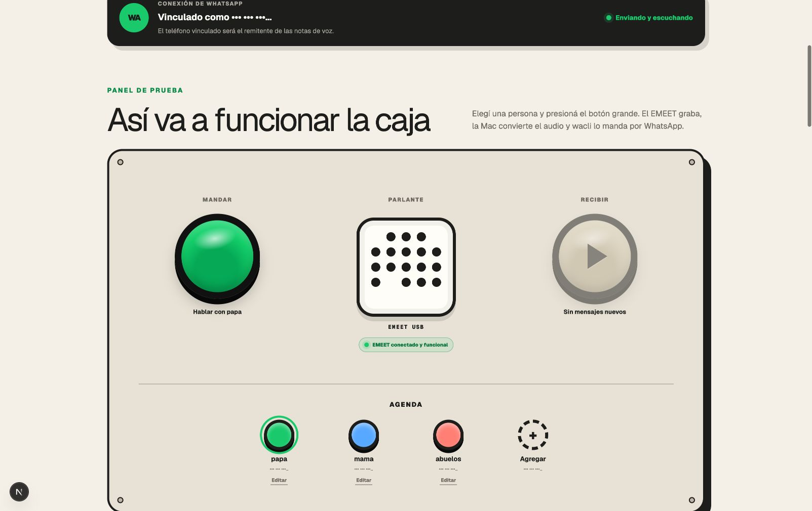
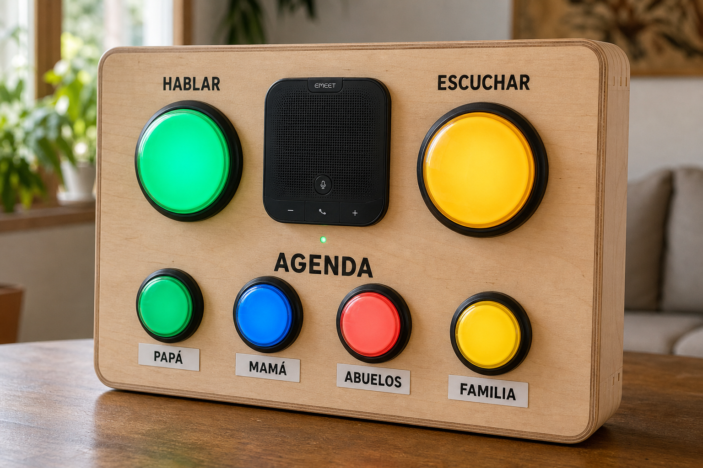

# Chapu WhatsApp Message Box

Prototipo artesanal de una caja de mensajes de voz sin pantalla. Un ESP32-S3
controla un speakerphone USB EMEET y botones arcade; una aplicación Next.js
recibe y entrega los audios y usa `wacli` como puente local con WhatsApp.

## Panel de control



## Concepto del hardware final



## Qué incluye

- Panel web que replica los controles físicos de Chapu.
- Grabación desde el navegador y desde el EMEET.
- Cola de mensajes entrantes con indicador de mensajes pendientes.
- Envío y recepción de notas de voz mediante `wacli`.
- Agenda editable y números ocultos en la interfaz. Un botón puede apuntar a
  un número o a un grupo de WhatsApp (se elige de la lista de grupos del
  número vinculado); los audios de ese grupo también llegan a Chapu.
- Estado del ESP32, parlante y micrófono USB.
- Seis botones físicos con lámpara: mandar, recibir y cuatro de agenda.
- Aviso de voz por el EMEET cuando llega un mensaje nuevo: alterna dos audios
  guardados en `data/notifications/dan.wav` y `chloe.wav` (WAV mono 16 kHz,
  fuera de Git) y a continuación dice el nombre del remitente. Los números que
  no están en la agenda también se aceptan y se anuncian como "desconocido"
  (`data/names/unknown.wav` reemplaza la voz generada).
- El botón recibir repite el último mensaje escuchado si no hay nuevos.
- Al apretar un botón de agenda, Chapu dice el nombre del contacto. El nombre
  se graba desde el editor de contacto de la web (`data/names/<id>.wav`); si
  no hay grabación, la Mac lo genera con la voz del sistema (`say`). El ESP32
  cachea los clips en PSRAM y los renueva cuando cambian.
- Saludo de arranque: cuando el ESP32 tiene Wi-Fi, EMEET y WhatsApp operativos
  dice "Bienvenido a la vitrola" una vez. Se genera con la voz de la Mac, o se
  usa `data/names/greeting.wav` si existe.
- El server arranca solo la escucha de WhatsApp (`wacli sync`) al iniciar, sin
  necesidad de abrir el panel.
- Recordatorios de mensajes sin escuchar: el aviso vuelve a sonar al minuto, a
  los 10 minutos y a la hora, solo entre las 07:00 y las 21:00 de la Mac, y
  también cuando el ESP32 arranca o se reconecta con mensajes pendientes. El
  aviso de llegada suena a cualquier hora.
- Firmware reproducible en `firmware/esp32`.

## Aplicación web

Requiere Node.js y `wacli` instalado en la Mac.

```bash
npm install
npm run dev
```

La interfaz queda disponible en `http://localhost:3000` y en la red local de la
Mac. El primer inicio crea los archivos de datos locales dentro de `data/`.

## Producción en la Mac mini

La caja corre desde una Mac mini de la casa como servicio de launchd
(`com.chapu.messagebox`, `npm start` en el puerto 3000). Para publicar cambios
desde la laptop: `scripts/deploy-mini.sh` sincroniza el código, hace el build y
reinicia el servicio. `data/` vive únicamente en la mini. Log del servicio en
`~/Library/Logs/chapu/server.log`. No correr `npm start` en otra máquina con la
misma sesión de WhatsApp: wacli solo puede estar conectado desde un lugar.

Para desarrollar en la misma mini mientras el servicio corre:

```bash
CHAPU_NO_SYNC=1 PORT=3001 npm run dev
```

`CHAPU_NO_SYNC=1` evita lanzar una segunda escucha de WhatsApp; los envíos
desde el server de desarrollo salen igual, delegados por el socket del
servicio, y los mensajes entrantes siguen llegando por el servicio.

## Firmware

Las instrucciones de configuración, compilación y carga están en
[`firmware/esp32/README.md`](firmware/esp32/README.md). Las credenciales Wi-Fi
se guardan únicamente en `firmware/esp32/main/wifi_secrets.h`, que Git ignora.

## Datos privados

El repositorio no incluye sesiones de WhatsApp, audios, avisos de voz, números
configurados, credenciales Wi-Fi ni direcciones locales. Estos datos permanecen en `data/` y
en el archivo local de secretos del firmware.

## API principal

- `POST /api/recordings`: recibe audio WAV del ESP32.
- `GET /api/recordings`: lista las grabaciones locales.
- `GET /api/recordings/:id`: entrega audio con soporte de Range.
- `GET /api/outbox`: administra la cola destinada al EMEET.
- `POST /api/device/status`: recibe el heartbeat del ESP32, aplica el botón de
  agenda presionado y devuelve el estado que deben mostrar las lámparas.
- `GET /api/device/names/:slot`: entrega el nombre hablado de un botón de agenda.
- `/api/settings/names/:id`: escucha, graba o borra el nombre de un contacto.
- `POST /api/outbox/release`: libera el próximo mensaje para Chapu, o repite el
  último escuchado si no hay nuevos; lo usan el botón recibir de la caja y el de
  la web.
- `/api/whatsapp/*`: autenticación, estado, lista de grupos y recepción
  mediante `wacli`.
